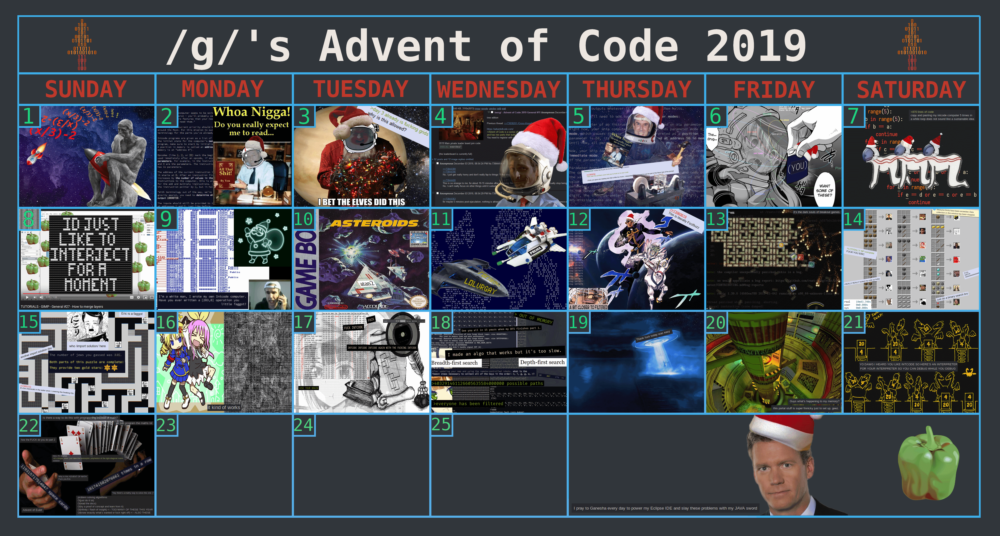

# Advent of Code
Status: Utterly Brainlet Filtered :joy_cat:
## Description
Advent of Code is an Advent calendar of small programming puzzles for a variety of skill sets and skill levels that can be solved in any programming language you like. People use them as a speed contest, interview prep, company training, university coursework, practice problems, or to challenge each other.
## Calendar Progress
- [x] 2020: 25/25
- [ ] 2019: 18/25
- [x] 2018: 25/25
- [ ] 2017: 07/25
- [ ] 2016: 03/25
- [ ] 2015: 08/25
## /aocg/

